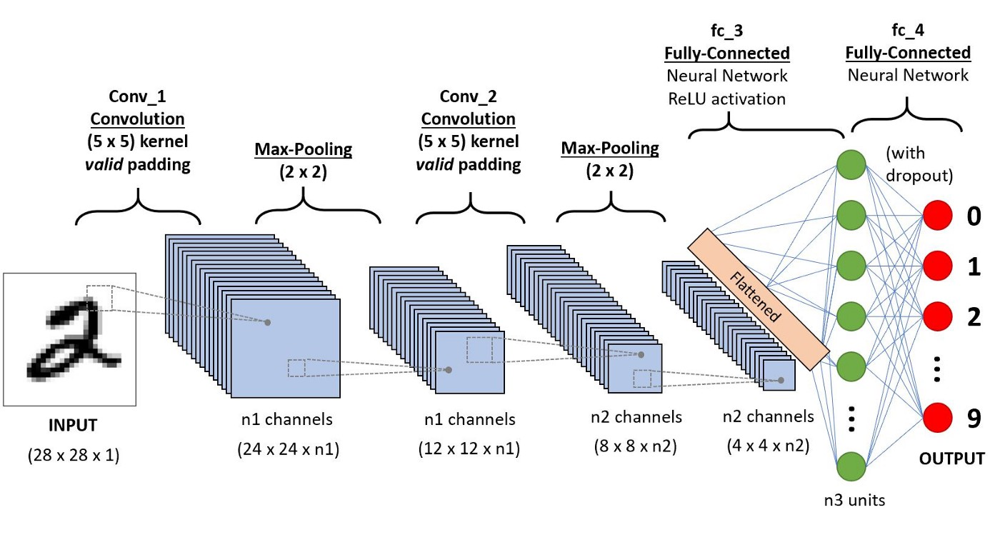

# Building a Multi-Class Convolutional Neural Network with PyTorch
This README demonstrates how to set up a basic convolutional neural network for mult-class image classification

## _Butterfly Image Classification - 75 Species_
### DATA: https://www.kaggle.com/datasets/gpiosenka/butterfly-images40-species

## What is a tensor?
A tensor is often thought of as a generalized matrix. That is, it could be a 1-D matrix (a vector is actually such a tensor), a 3-D matrix (something like a cube of numbers), even a 0-D matrix (a single number), or a higher dimensional structure that is harder to visualize. The dimension of the tensor is called its rank.

But this description misses the most important property of a tensor!

A tensor is a mathematical entity that lives in a structure and interacts with other mathematical entities. If one transforms the other entities in the structure in a regular way, then the tensor must obey a related transformation rule.

## What do tensors have to do with images?
When we transform an image into a tensor, each of those pixels in the position they hold in the image, get transformed into tensors. Once we transform these tensors, we can train our models with this data, among other things. We can mirror images, resize, crop, and manipulate in other ways that are useful to us.

In the case of RGB images we have three channels; red, green, and blue and each of these channels contains the intensity value of pixels in the image in that particular color. This can be represented by an order three tensor and there are two major ordering conventions.

## What is a kernel?
The kernel is a matrix that moves over the input data, performs the dot product with the sub-region of input data, and gets the output as the matrix of dot products. Kernel moves on the input data by the stride value.

## What is a convolution? 
-  In most simple terms, a convolution is like sliding a filter over an image
- Convolution is a mathematical operation on two functions that produces a third function that expresses how the shape of one is modified by the other.
- In image processing, convolution is the process of transforming an image by applying a kernel over each pixel and its local neighbors across the entire image. The kernel is a matrix of values whose size and values determine the transformation effect of the convolution process.
- The Convolution Process involves these steps. (1)It places the Kernel Matrix over each pixel of the image (ensuring that the full Kernel is within the image), multiplies each value of the Kernel with the corresponding pixel it is over. (2)Then, sums the resulting multiplied values and returns the resulting value as the new value of the center pixel. (3) This process is repeated across the entire image.

- As we see in the picture above, a 3x3 kernel is convoluted over a 7x7 source image. Center Element of the kernel is placed over the source pixel. The source pixel is then replaced with a weighted sum of itself and surrounding pixels. The output is placed in the destination pixel value. In this example, at the first position, we have 0 in source pixel and 4 in the kernel. 4x0 is 0, then moving to the next pixel we have 0 and 0 in both places. 0x0 is 0. Then again 0x0 is 0. Next at the center there is 1 in the source image and 0 in the corresponding position of kernel. 0x1 is 0. Then again 0x1 is 0. Then 0x0 is 0 and 0x1 is 0 and at the last position it is -4x2 which is -8. Now summing up all these results we get -8 as the answer; so the output of this convolution operation is -8. This result is updated in the Destination image.

## What is pooling? and what are commong pooling functions in PyTorch?
### https://medium.com/@bdhuma/which-pooling-method-is-better-maxpooling-vs-minpooling-vs-average-pooling-95fb03f45a9  

Pooling is performed in neural networks to reduce variance and computation complexity. Many a times, beginners blindly use a pooling method without knowing the reason for using it. Here is a comparison of three basic pooling methods that are widely used.

The three types of pooling operations are:

1. Max pooling: The maximum pixel value of the batch is selected.
2. Min pooling: The minimum pixel value of the batch is selected.
3. Average pooling: The average value of all the pixels in the batch is selected.

We cannot say that a particular pooling method is better over other generally. The choice of pooling operation is made based on the data at hand. Average pooling method smooths out the image and hence the sharp features may not be identified when this pooling method is used.

Max pooling selects the brighter pixels from the image. It is useful when the background of the image is dark and we are interested in only the lighter pixels of the image. For example: in MNIST dataset, the digits are represented in white color and the background is black. So, max pooling is used. Similarly, min pooling is used in the other way round.

## What is a convolutional neural network (cnn) ?
- A neural network is a method in artificial intelligence that teaches computers to process data in a way that is inspired by the human brain. 
- It is a type of machine learning process, called deep learning, that uses interconnected nodes or neurons in a layered structure that resembles the human brain. 
- It creates an adaptive system that computers use to learn from their mistakes and improve continuously.
- A cnn is a class of neural network that uses convolutional layers for analysis of visual data

> Neural Networks receive an input (a single vector), and transform it through a series of hidden layers.  
> Each hidden layer is made up of a set of neurons, where each neuron is fully connected to all neurons in 
> the previous layer, and where neurons in a single layer function completely independently and do not share 
> any connections. The last fully-connected layer is called the “output layer” and in classification settings 
> it represents the class scores.

> Regular Neural Nets don’t scale well to full images. In CIFAR-10, images are only of size 32x32x3 (32 wide, 
> 32 high, 3 color channels), so a single fully-connected neuron in a first hidden layer of a regular Neural 
> Network would have 32*32*3 = 3072 weights. This amount still seems manageable, but clearly this 
> fully-connected structure does not scale to larger images. For example, an image of more respectable size, 
> e.g. 200x200x3, would lead to neurons that have 200*200*3 = 120,000 weights. Moreover, we would almost  
> certainly want to have several such neurons, so the parameters would add up quickly! Clearly, this full 
> connectivity is wasteful and the huge number of parameters would quickly lead to overfitting.

## What are the building blocks of a cnn in PyTorch?
- **Imaging preprocessing scheme:** Preprocessing refers to all the transformations on the raw data before it is fed to the machine learning or deep learning algorithm. Images usually are not represented in a way that is easy for a network to make sense of raw. As such, it is in most all cases, a requirement for a well performing model to have inputs transformed into a way that eccentuates the features that are most important for the problem at hand.

- **Input Layer:** Holds the raw pixel values of the image.

- **Convolutional Layer(s):** will compute the output of neurons that are connected to local regions in the input, each computing a dot product between their weights and a small region they are connected to in the input volume. 

- **Rectified Linear Unit Function Layer(s):** will apply an elementwise activation function, such as the max(0,x) thresholding at zero. This leaves the size of the volume unchanged.

- **Pooling Layer(s):** Performs downsampling operations along the spatial dimensions (width, height).

- **Fully Connected Layer(s):** Computes the class scores where each of the numbers correspond to a class score, such as among the 10 categories of CIFAR-10. As with ordinary Neural Networks and as the name implies, each neuron in this layer will be connected to all the numbers in the previous volume.

- **Loss Function:** The loss function is the criterion on which the network measures success. For example, in simple linear regression, we try to minimize mean square error. There are numerous loss funcitons that can be used for different applications. Binary cross-entropy loss is a commonly used for single-class prediction. Cross-entropy loss can be extended for use in multi-class classification.

- **Optimizer:** The optimizer is a function or algorithm that updates the network parameters at each epoch, and is integral to the learning process. The weights of the parameters are increased or decreased progressively in attempt to reduce loss on the next pass.

## Problem Description and Data
For this exercise, we will be using the "Butterfly Image Classification 75 species" available on Kaggle.com
It contains 9285 training, 375 testing,and 375 validation images all in 224 X 224 X 3 jpeg format.

Our objective is to train a convolutional neural network that has the greatest accuracy in predicting correct species/classes over the testing image set.

We will do this by training the model on the 9285 training images, using the model to make predictions on the testing data, and running a basic Sci-Kit Learn classification report.

# The Steps 
1. Preprocessing and Loading
2. Model Constructor and Intializing
3. Selecting Optimizer and Loss Metric
4. Training, Validation, and Tuning
5. Making Predictions on Test Data

## *(1) Preprocessing and Loading*
PyTorch offers a number of built-in transformation types that we can use sequentially, or in composition. 
As we see in the image below, I first specify a *semi* arbitrary mean and standard deviation normalization pointer, which we can use in the composition.

We use different compositions for the training data than for both testing and validation data.

**Composition(Training):**
- RandomResizedCrop: Crop a random portion of image and resize it to a given size.
- RandomHorizontalFlip: At a certain probability, an image will be flipped on it's horizontal axis
- ToTensor: Converts the image data into tensor form
- normalize: Changes the range of pixel intesities by the mean and standard deviation specified for each channel

**Composition(Validation and Testing):**
- Resize and CenterCrop: By increasing the image size, and center cropping, we are effectively zooming in on the center of the image by a small degree. 
- ToTensor: Converts the image data into tensor form
- normalize: Changes the range of pixel intesities by the mean and standard deviation specified for each channel

To illustrate this process, we will implement a simple plotting function to show 25 random images from a random batch. By commenting out the "normalize" pointer in the compose, and running the plotting twice, we can illustrate what the transforms have done to the training data.

## Visualizing 25 un-normalized images

## Visualizing 25 normalized images

## *(2) Model Constructor and Intializing*
The model constructor is where we make our specifications for the convolutional neural network. First, we make our convolutional, pooling, and fully connected layers.

 The forward method can be called to make a prediction. There are three typical activation functions 'relu, tanh, sigmoid'. Relu is useful, as sigmoid and tanh are bounded <|1|, so as multiple gradients are multiplied together, the number doesn't neccesarily approach 0. We apply the relu function to the convolutional layers, and could potentially use a sigmoid activation in the fully connected layer to make output probabilities instead of values, however, that is not needed for this particular problem.

For the forward pass method, we specify the order in which these functions are applied sequentially.
1. Convolutional Layer 1
2. ReLU activation 1
3. Max Pooling 1
4. Convolutional Layer 2
5. ReLU activation 2
6. Max Pooling 2
7. Flatten Layers
8. Fully Connected Layer (linear function)

 
### Here is a graphical representation of the model we intend to implement:

### Here is the constructor as coded:

Note how at the end of the constructor, we initialize the model with our desired specification of layers. 
out_1 = The number of maps after the first convolution (6 feature maps), and the number of maps passed forward to the second convolution.
out_2 = The number of maps after the second convolution (12 feature maps), and the number of maps passed forward to the second pooling layer.

** CNN(6,12) = CNN(Out_1, Out_2)

To make a prediction, the forward pass is implmented on the input for the pointer we initialized the model with.

*net = CNN(Out_1, Out_2)*
*output = net(input)*

## *(3) Selecting Optimizer and Loss Metric*
Selecting the loss function and optimizer are very problem specific. Cross-entropy loss is the canonically used loss function for multi-class classification problem.

For the optimizer, I selected ADAM, as it is very fast, and generally outperforms stochastic gradient descent on accuracy. I tried running the model with various weight decays, and found them to lower accuracy in this scenario.

## *(4) Training, Validation, and Tuning*
I chose to train the model over 500 epochs, which took 10.9 hours to complete on my new MacBook Pro with an M1 chip.

To train the model, there is functionally no difference between a cnn and a more traditional nn.
Steps:
1. Iterate over the DataLoader for training data
2. Obtain samples for each batch
3. Zero out the gradient
4. Perform forward pass (Make predictions)
5. Calculate loss
6. Perform backward pass (differentiate loss w.r.t parameters)
7. Perform optimization (update parameters)

Simultaneously, we are also running the validation data through the updated parameters for each epoch.
We run this with gradient off, as we don't need gradients for making predictions, and it is computationally expensive to validate with this unneccessary work.

To tune the model, we reduce the epochs used in training, and compare accuracy on the testing data after we change specifications and hyper-paramters. Here are a few examples I tried...

- 500 Epochs, no weight decay, kernel size = 5: Acc =.7973
- 500 Epochs, weight_decay=1e-5, kernel size = 5: Acc = .7600
- 5 Epochs, no weight decay, max pooling, kernel size = 5: Acc = .5867
- 5 Epochs, no WD, min pooling, kernel size = 5: Acc = .5040
- 5 Epochs, no weight decay, max pooling, kernel size = 7: Acc = .3653
- 5 Epochs, no weight decay, max pooling, kernel size = 3: Acc = .4907

### Code for training the model:

## Training Results

As we see in the graph above, loss steadily decreases as we approach 270 epochs. We then observe loss flucuating and rising. This tipping point is evidence of overfitting past ~270 epochs, as the network begins to chase changes that are random variation in the batches. So, we would most likely choose to re-run the model with 270 epochs to get the most reliable results on the testing data.

## * (5) Making Predictions on Test Data*

### Here is the code for making predictions on the testing data, and running the classification report:

### Here are the results of the classification report:

